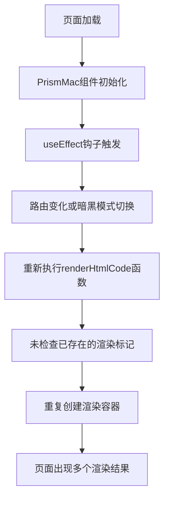
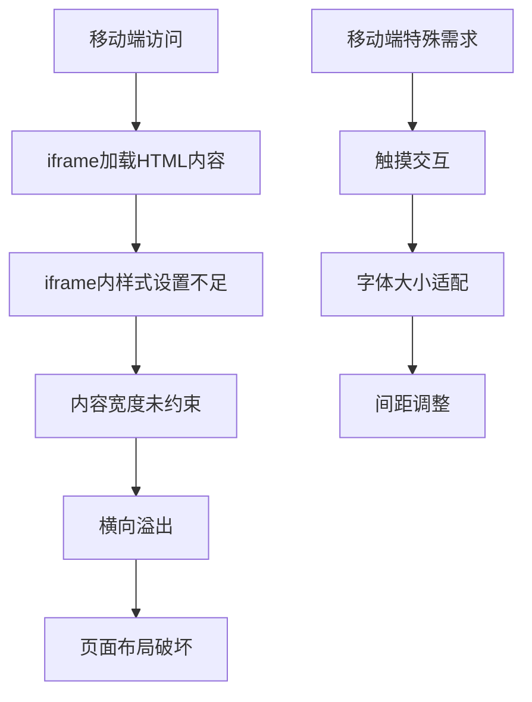
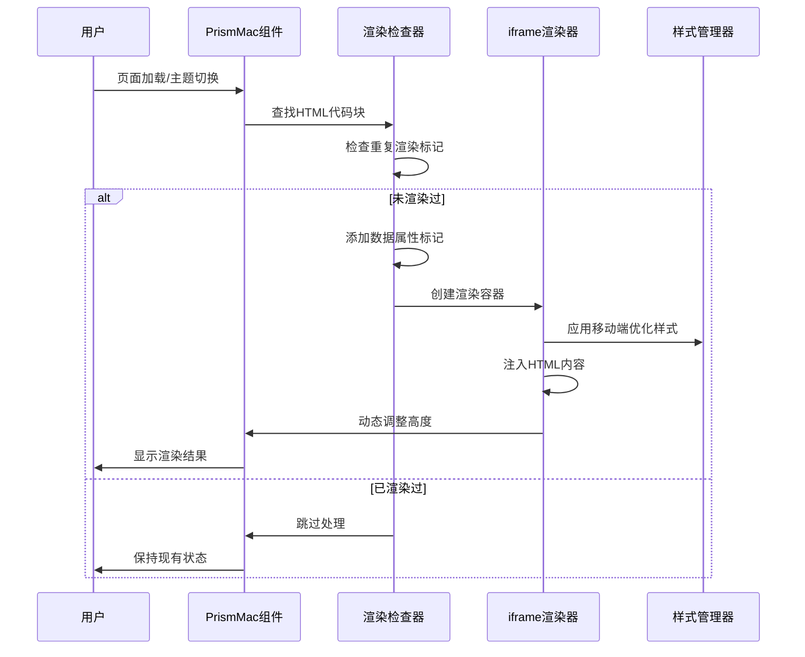

# HTML渲染功能问题修复设计

## 概述

本设计文档针对NotionNext项目中HTML渲染功能存在的两个关键问题：重复渲染导致页面出现多个渲染结果，以及移动端设备上的显示问题。通过分析现有代码和问题根因，制定系统性的修复方案。

## 问题分析

### 问题1：重复渲染导致多个渲染结果

**现象描述**
- 在同一个页面上，同一个HTML代码块会产生多个渲染结果
- 渲染容器在页面的上方和下方都出现
- 用户看到重复的HTML渲染内容

**根因分析**


**技术原因**
1. **缺乏防重复渲染机制**：当前代码只检查`parentElement.querySelector('.html-render-container')`，但在某些情况下检查失效
2. **页面动态更新触发**：路由变化、主题切换等事件会重新触发`useEffect`，导致重复执行渲染逻辑
3. **DOM查询范围不准确**：检查机制可能因为DOM结构变化而失效

### 问题2：移动端显示问题

**现象描述**
- 在手机设备上，HTML渲染内容超出屏幕宽度
- 页面排版错乱，出现水平滚动条
- 内容在小屏幕设备上显示不正常

**根因分析**


**技术原因**
1. **iframe内样式不足**：当前iframe内的CSS缺乏移动端优化
2. **宽度约束缺失**：HTML内容没有强制宽度限制，导致在小屏幕上溢出
3. **响应式断点不足**：现有CSS只有768px断点，缺乏更细致的移动端适配

## 解决方案设计

### 方案1：防重复渲染机制增强

#### 1.1 添加数据属性标记
```javascript
// 为已处理的代码元素添加唯一标记
codeElement.setAttribute('data-html-rendered', 'true')
```

#### 1.2 严格的重复检查机制
```javascript
// 检查代码元素是否已被处理
if (codeElement.getAttribute('data-html-rendered') === 'true') {
  return
}

// 检查父级元素中是否已存在渲染容器
const existingContainer = parentElement.parentNode.querySelector('.html-render-container')
if (existingContainer) {
  return
}
```

#### 1.3 全局渲染状态管理
```javascript
// 维护已渲染代码块的映射表
const renderedCodeBlocks = new WeakSet()

if (renderedCodeBlocks.has(codeElement)) {
  return
}
renderedCodeBlocks.add(codeElement)
```

### 方案2：移动端显示优化

#### 2.1 iframe内容样式增强
```css
/* 在iframe内注入的样式增强 */
* {
  box-sizing: border-box;
  max-width: 100%;
}

body {
  margin: 8px;
  padding: 0;
  overflow-x: hidden;
  word-wrap: break-word;
  word-break: break-word;
}

/* 防止表格等元素溢出 */
table {
  width: 100%;
  table-layout: fixed;
}

img, video, iframe {
  max-width: 100%;
  height: auto;
}

/* 超小屏幕优化 */
@media (max-width: 480px) {
  body {
    margin: 4px;
    font-size: 14px;
  }
}
```

#### 2.2 容器响应式改进
```css
/* 新增480px断点支持 */
@media (max-width: 480px) {
  .html-render-container {
    margin: 8px 0;
    border-radius: 4px;
  }
  
  .html-render-container .title-bar {
    padding: 8px 10px;
    font-size: 12px;
  }
  
  .html-render-container iframe {
    min-height: 150px;
  }
}

/* 超小屏幕 */
@media (max-width: 320px) {
  .html-render-container {
    margin: 6px 0;
  }
  
  .html-render-container .title-bar {
    padding: 6px 8px;
    font-size: 11px;
  }
}
```

#### 2.3 动态视口设置
```javascript
// 在iframe内容中添加更严格的视口控制
<meta name="viewport" content="width=device-width, initial-scale=1.0, maximum-scale=1.0, user-scalable=no">
```

## 技术实现架构

### 组件交互图


### 核心函数重构设计

#### 防重复渲染函数
```javascript
const isAlreadyRendered = (codeElement) => {
  // 检查数据属性标记
  if (codeElement.getAttribute('data-html-rendered') === 'true') {
    return true
  }
  
  // 检查父级容器中的渲染结果
  const parentElement = codeElement.closest('.code-toolbar') || codeElement.closest('pre')
  if (!parentElement) return false
  
  const existingContainer = parentElement.parentNode.querySelector('.html-render-container')
  return !!existingContainer
}
```

#### 移动端样式注入函数
```javascript
const generateMobileOptimizedStyle = () => {
  return `
    <style>
      * {
        box-sizing: border-box;
        max-width: 100%;
      }
      body {
        margin: 8px;
        padding: 0;
        overflow-x: hidden;
        word-wrap: break-word;
        word-break: break-word;
        font-family: -apple-system, BlinkMacSystemFont, 'Segoe UI', 'Roboto', sans-serif;
        line-height: 1.6;
        color: #333;
      }
      table {
        width: 100%;
        table-layout: fixed;
        border-collapse: collapse;
      }
      img, video, iframe, canvas {
        max-width: 100%;
        height: auto;
      }
      pre, code {
        overflow-x: auto;
        white-space: pre-wrap;
        word-wrap: break-word;
      }
      @media (max-width: 480px) {
        body {
          margin: 4px;
          font-size: 14px;
        }
        h1 { font-size: 1.5em; }
        h2 { font-size: 1.3em; }
        h3 { font-size: 1.1em; }
      }
      @media (max-width: 320px) {
        body {
          margin: 2px;
          font-size: 13px;
        }
      }
    </style>
  `
}
```

## 实现流程

### 阶段1：防重复渲染机制实现

1. **修改renderHtmlCode函数**
   - 在函数开始处添加重复检查逻辑
   - 为处理过的代码元素添加data-html-rendered属性
   - 增强父级容器检查机制

2. **添加渲染状态跟踪**
   - 使用WeakSet维护已渲染元素
   - 在DOM变化时清理失效的跟踪状态

### 阶段2：移动端显示优化

1. **升级iframe内样式**
   - 修改generateMobileOptimizedStyle函数
   - 添加更严格的宽度约束
   - 优化触摸设备体验

2. **完善响应式CSS**
   - 在html-render.css中添加480px和320px断点
   - 优化容器在小屏幕上的显示
   - 调整字体大小和间距

### 阶段3：集成测试与验证

1. **功能测试**
   - 验证重复渲染问题是否解决
   - 测试多种设备尺寸的显示效果
   - 检查主题切换时的稳定性

2. **性能优化**
   - 监控渲染性能影响
   - 优化DOM操作效率
   - 确保内存使用合理

## 风险评估与缓解

### 技术风险

| 风险类型 | 风险描述 | 影响程度 | 缓解措施 |
|---------|---------|---------|----------|
| 兼容性风险 | 新的检查机制可能影响现有功能 | 中等 | 充分的回归测试 |
| 性能风险 | 额外的DOM检查可能影响性能 | 低 | 使用高效的查询方法 |
| 样式冲突 | 新的CSS规则可能与现有样式冲突 | 低 | 使用特定的类名作用域 |

### 实施风险

| 风险类型 | 风险描述 | 影响程度 | 缓解措施 |
|---------|---------|---------|----------|
| 测试覆盖 | 移动端设备测试不充分 | 中等 | 使用多种设备和浏览器测试 |
| 用户体验 | 修复过程中可能暂时影响用户体验 | 低 | 分阶段发布和灰度测试 |

## 测试策略

### 功能测试用例

1. **重复渲染防护测试**
   - 在同一页面多次触发渲染
   - 验证页面刷新后的渲染状态
   - 测试主题切换时的行为

2. **移动端显示测试**
   - iPhone SE (375px) 显示效果
   - Android 设备 (360px) 显示效果
   - 平板设备 (768px) 显示效果
   - 横竖屏切换测试

### 性能测试

1. **渲染性能测试**
   - 测量DOM操作耗时
   - 监控内存使用变化
   - 验证页面加载速度影响

2. **移动端性能测试**
   - 测试iframe加载速度
   - 验证触摸交互响应时间
   - 检查电池消耗影响

## 监控与维护

### 错误监控

1. **渲染错误跟踪**
   - 监控iframe加载失败情况
   - 记录DOM操作异常
   - 统计重复渲染检测效果

2. **用户体验监控**
   - 收集移动端用户反馈
   - 监控页面加载性能指标
   - 跟踪功能使用率

### 维护计划

1. **定期检查**
   - 每月检查移动端适配效果
   - 季度性能指标评估
   - 年度功能优化评估

2. **升级准备**
   - 跟踪浏览器新特性
   - 准备响应式设计趋势
   - 维护设备兼容性列表