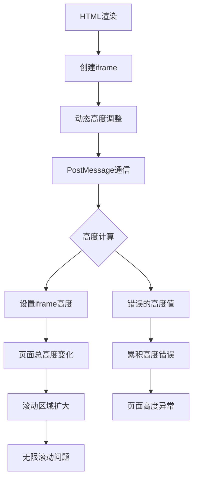

# HTML渲染页面滚动问题修复设计

## 概述

本设计文档旨在解决NotionNext项目中HTML渲染功能导致的页面无限滚动问题。当HTML代码块被渲染后，页面可以无限向下滚动，出现大量空白区域，严重影响用户体验和页面内容的正常浏览。

## 问题分析

### 核心问题
1. **无限滚动**：HTML渲染后页面可以一直往下滑动，无法滑动到真正的底部
2. **空白区域**：额外滚动区域显示为空白内容
3. **内容遮挡**：影响页面尾部内容的正常查看
4. **用户体验**：破坏了页面的正常布局和导航体验

### 问题根源分析



### 技术层面分析

基于当前代码分析，问题可能来源于：

1. **iframe高度计算错误**
   - `adjustIframeHeight`函数可能返回了错误的高度值
   - 多个高度属性的最大值计算可能不准确
   - `scrollHeight`和`offsetHeight`在某些情况下可能返回异常值

2. **PostMessage机制问题**
   - 高度调整消息可能被重复发送
   - 消息监听器可能没有正确过滤iframe来源
   - 高度设置时可能产生了累积错误

3. **CSS样式冲突**
   - iframe内部样式可能与外部容器产生冲突
   - `contain: layout style paint`属性可能影响高度计算
   - 响应式样式可能在动态调整时产生问题

## 解决方案设计

### 方案一：高度计算优化（推荐）

#### 核心策略
- 改进iframe高度计算逻辑
- 增加高度边界检查和限制
- 优化PostMessage通信机制

#### 技术实现

```javascript
// 改进的高度调整函数
function adjustIframeHeight() {
  const body = document.body;
  const html = document.documentElement;
  
  // 多种高度计算方法
  const heights = [
    body.scrollHeight,
    body.offsetHeight,
    html.clientHeight,
    html.scrollHeight,
    html.offsetHeight
  ];
  
  // 过滤无效值并取最小的合理值
  const validHeights = heights.filter(h => h > 0 && h < 10000);
  const calculatedHeight = Math.min(...validHeights);
  
  // 设置合理的最小和最大高度限制
  const minHeight = 100;
  const maxHeight = 5000;
  const finalHeight = Math.max(minHeight, Math.min(calculatedHeight, maxHeight));
  
  // 防抖处理，避免频繁发送消息
  clearTimeout(window.heightAdjustTimer);
  window.heightAdjustTimer = setTimeout(() => {
    window.parent.postMessage({
      type: 'resize',
      height: finalHeight + 20,
      iframeId: window.frameElement?.id // 添加iframe标识
    }, '*');
  }, 100);
}
```

#### 外部监听器改进

```javascript
// 改进的消息监听器
window.addEventListener('message', (event) => {
  // 验证消息来源和格式
  if (event.data && 
      event.data.type === 'resize' && 
      typeof event.data.height === 'number' &&
      event.data.height > 0 &&
      event.data.height < 5000) {
    
    // 找到对应的iframe
    const targetIframe = event.source?.frameElement;
    if (targetIframe && targetIframe.classList.contains('html-render-iframe')) {
      targetIframe.style.height = event.data.height + 'px';
    }
  }
});
```

### 方案二：固定高度模式

#### 核心策略
- 设置iframe固定高度
- 内部内容通过滚动条处理
- 简化高度管理逻辑

#### 技术实现

```javascript
// 固定高度配置
const FIXED_IFRAME_HEIGHT = 400; // 400px固定高度

// 创建iframe时设置固定高度
const iframe = document.createElement('iframe');
iframe.className = 'html-render-iframe';
iframe.style.height = FIXED_IFRAME_HEIGHT + 'px';
iframe.sandbox = 'allow-scripts allow-same-origin allow-forms allow-popups allow-modals';
```

### 方案三：CSS容器查询优化

#### 核心策略
- 使用CSS容器查询技术
- 通过ResizeObserver监听容器变化
- 实现更精确的高度控制

#### 技术实现

```javascript
// 使用ResizeObserver监听iframe内容变化
function setupResizeObserver(iframe) {
  const resizeObserver = new ResizeObserver(entries => {
    for (let entry of entries) {
      const newHeight = Math.min(entry.contentRect.height + 40, 3000);
      iframe.style.height = newHeight + 'px';
    }
  });
  
  iframe.onload = () => {
    const iframeBody = iframe.contentDocument?.body;
    if (iframeBody) {
      resizeObserver.observe(iframeBody);
    }
  };
}
```

## 实施计划

### 阶段一：问题诊断和验证
1. 在开发环境中复现问题
2. 添加调试日志，监控高度计算过程
3. 分析异常高度值的来源

### 阶段二：核心修复实施
1. 实施方案一的高度计算优化
2. 添加高度边界检查机制
3. 改进PostMessage通信逻辑

### 阶段三：测试和优化
1. 在不同浏览器中测试修复效果
2. 验证移动端和桌面端的兼容性
3. 性能测试和用户体验验证

### 阶段四：备选方案准备
1. 准备固定高度模式作为降级方案
2. 实现用户可配置的高度限制选项

## 技术考量

### 兼容性要求
- 支持主流浏览器（Chrome、Firefox、Safari、Edge）
- 兼容移动端浏览器
- 保持与现有主题系统的兼容性

### 性能影响
- 减少不必要的高度重计算
- 优化PostMessage通信频率
- 避免引起页面重排和重绘

### 安全考虑
- 维护iframe沙盒安全模式
- 验证高度值的合理性，防止恶意攻击
- 确保消息来源的可靠性

## 监控和维护

### 错误监控
- 添加高度异常值的监控和报警
- 记录iframe渲染失败的情况
- 监控用户关于滚动问题的反馈

### 性能监控
- 监控页面渲染性能
- 跟踪iframe高度调整的频次
- 测量用户滚动体验的流畅度

### 维护计划
- 定期检查和优化高度计算算法
- 根据用户反馈调整高度限制参数
- 持续改进iframe渲染性能- 保持与现有主题系统的兼容性

### 性能影响
- 减少不必要的高度重计算
- 优化PostMessage通信频率
- 避免引起页面重排和重绘

### 安全考虑
- 维护iframe沙盒安全模式
- 验证高度值的合理性，防止恶意攻击
- 确保消息来源的可靠性

## 监控和维护

### 错误监控
- 添加高度异常值的监控和报警
- 记录iframe渲染失败的情况
- 监控用户关于滚动问题的反馈

### 性能监控
- 监控页面渲染性能
- 跟踪iframe高度调整的频次
- 测量用户滚动体验的流畅度

### 维护计划
- 定期检查和优化高度计算算法
- 根据用户反馈调整高度限制参数
- 持续改进iframe渲染性能


